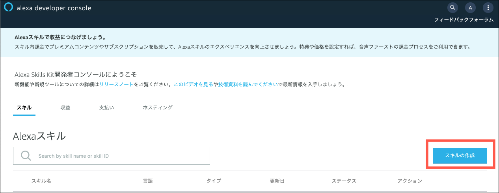
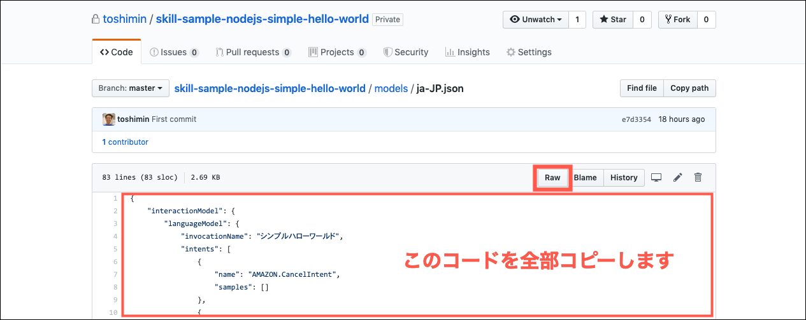
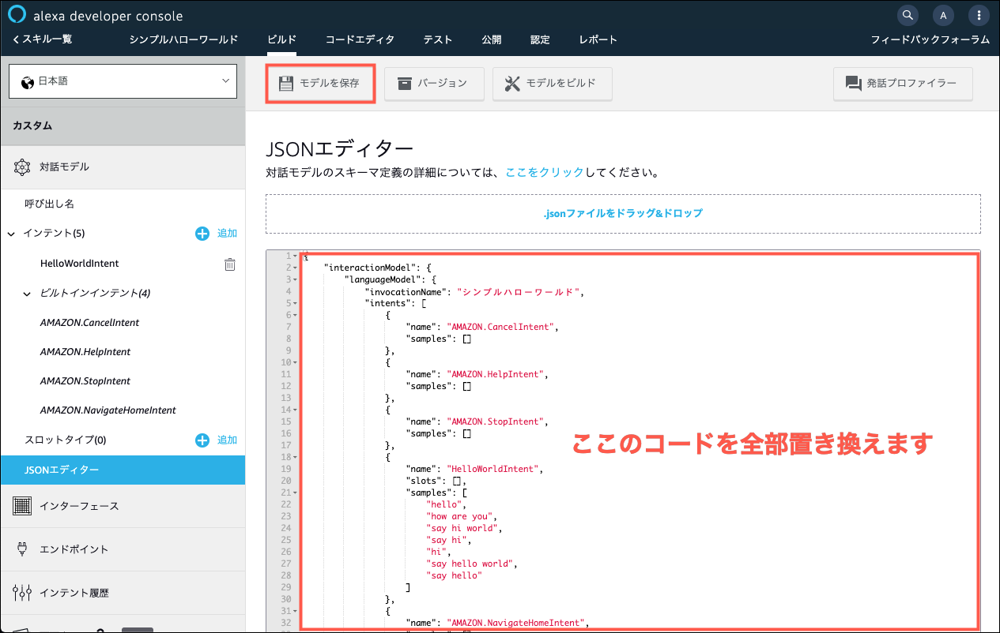
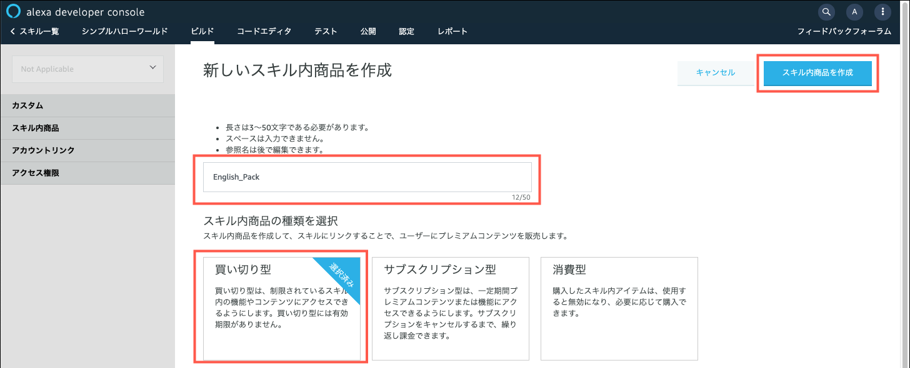
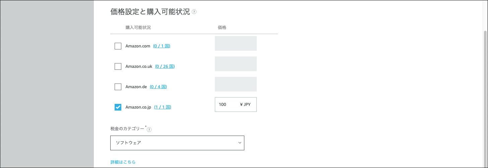
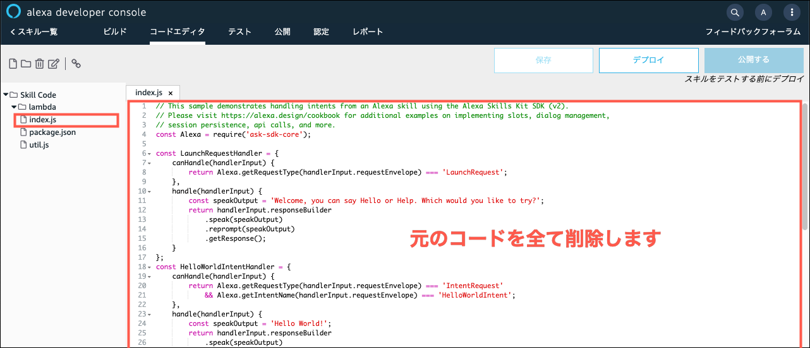
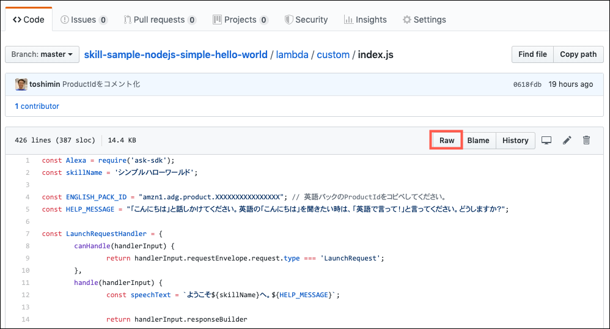
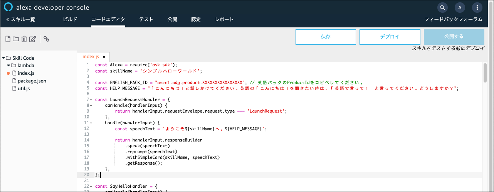

**[Alexaスキル内課金ワークショップ](../README.md)**

# 課題１ 「シンプルハローワールド」のセットアップ

## 方法1: Alexa Hosted-Skill を使ってセットアップする

Alexa-Hosted スキルを使うと、開発者コンソールから離れることなく、スキルのビルド、編集、公開できます。

Alexa-Hostedスキルが提供するサービスの詳細については、新しいタブを開き、[こちら](https://developer.amazon.com/docs/hosted-skills/build-a-skill-end-to-end-using-an-alexa-hosted-skill.html)を参照してください。

### セットアップ手順

#### Alexa Hostedの準備
1.  **[Alexaの開発者ポータル](https://developer.amazon.com/ja/alexa)** を開き、画面右上の「ログイン」をクリックします。

    (開発者アカウントをお持ちでない場合は、**[Amazon Developerアカウントを作成]ボタンをクリックせず**、お手持ちのAmazonアカウントでログインします。詳しい理由は[こちら](https://developer.amazon.com/ja/blogs/alexa/post/9f852a38-3a44-48bd-b78f-22050269d7c7/hamaridokoro)を参照してください。)

    

1. ログインしたら、上の「Alexa」メニューにマウスオーバーして、**Alexa Skills Kit**をクリックします。

    

1. **Alexa 開発者コンソール** が開いたら、右上の **「スキル作成」** ボタンをクリックします。

    

1. **スキル名**を入力します。この名前はスキルを公開する際、スキルストアに表示され、ユーザーが参照する名前になります。デフォルトの言語は**日本語**を選択します。

    

1. **スキルに追加するモデル**は**カスタム**を選択します。

    

1. **スキルのバックエンドリソースをホスティングする方法を選択** では、**Alexaがホスト**を選択します。スクロールして画面の上の方まで戻り、**スキルを作成**ボタンをクリックします。
これには数分かかる場合があります。作成が完了するとコンソールの**ビルド**タブに遷移します。

    

#### 対話モデルコードの作成

1. 左のナビゲーションパネルの**対話モデル**のグループの一番下にある**JSONエディター**をクリックします。

    
    
    画面中央に大きなテキストエディターが表示されます。

1. ソースツリーの **models** フォルダの下の[ja-JP.json](../models/ja-JP.json)
    のコードを丸ごとコピーします。この時、RAWボタンをクリックするとコピーしやすくなります。

    

1. JSONエディターにコピーしたコードを上書きペーストして置き換えます。置き換えたら**モデルを保存**ボタンをクリックします。

    

1. スキルの呼び出し名を変えたい場合は、**呼び出し名**タブをクリックして変更します。ここでは「シンプルハローワールド」のままにしておきます。

    

    > 呼び出し名とは、ユーザーがスキルを呼び出す際に使うフレーズのことです。ユーザーは「アレクサ、<起動フレーズ>を開いて」のように話しかけてスキルを起動します。

1. **モデルをビルド** をクリックします。

    

    ビルドに失敗した場合は、エラーメッセージを参考にトラブルシューティングを行ってください。

	> コピーしたJSON形式の対話モデルに基づいて、インテントなどが自動的に反映されていることに気づいたでしょうか。ここで対話モデルがどのような設定になっているかをしばらく探索してみてください。インテント、サンプル発話などについて詳しく知りたい場合は、新しいタブを開いて[技術文書:インテント、発話、スロットの作成](https://developer.amazon.com/ja/docs/custom-skills/create-intents-utterances-and-slots.html)を参照してください。

#### スキル内商品の登録

このサンプルでは「英語パック」と言う買い切り型のスキル内商品を１つ登録します。

1. 開発者コンソールの **ビルド** タブで、左側の **スキル内商品** セクションをクリックして、マネタイゼーションツールを開きます。
    

1. 画面右上の **スキル内商品を作成** をクリックします。
    

1. スキル内商品の参照名を入力します。これはコードからスキル内商品を参照するための識別子です。スペースや特殊記号を含まない英語名で入力します。このサンプルのコードでは、`English_Pack` という参照名を想定しています。
    > 参照名のスペルは正確に入力してください。この名前はサンプルコードから参照されるため、一致しないとサンプルコードが動作しません。

1. スキル内商品の種類は**買い切り型**を選択し、画面右上の **スキル内商品を作成** ボタンをクリックします。
    

1. **サポートされる言語** の下の **新しい言語を追加** をクリックします。
    

1. **日本語(日本)** を選択します。
    

1. 商品登録に必要な入力項目が表示されます。あります。ここでは以下のように入力してください。

    項目|説明|サンプル値
    ---|----|--------
    **表示名**|この商品の表示名。 | 英語パック|
    **説明**| 商品の簡単な説明。 ユーザーはこの説明を音声で聞くことになります。| 英語パックでは、英語で「こんにちは」と言ってくれます。|
    **詳細な説明**| 商品の機能や使用要件など詳細な説明。画面付きデバイスの購入カードなどに表示されます。| 英語パックでは、英語で「こんにちは」と言ってくれます。|
    **小さいアイコン**| スキルストアや Alexa アプリで商品表示に利用する小さいアイコン。| https://skillsassets.s3-ap-northeast-1.amazonaws.com/icons/EnglishPack_108.png|
    **大きいアイコン**| スキルストアや Alexa アプリで商品表示に利用する大きいアイコン。| https://skillsassets.s3-ap-northeast-1.amazonaws.com/icons/EngishPack_512.png|
    **購入プロンプトの説明**| ユーザーが購入を実行したときに聞く商品の説明です。| 英語パックを購入すると、英語で「こんにちは」と言ってくれます。|
    **購入確認の説明**| Alexaコンパニオンアプリの購入後確認カードに表示されます。| 挨拶パックを購入しました。フランス語、スペイン語、ヒンズー語など、様々な言語の挨拶を聞くことができます。|
    > アイコンは好みのものに置換えても大丈夫です。ISPやスキルのアイコン作成にお困りなら、[Alexa Skill Icon Builder](https://developer.amazon.com/docs/tools/icon-builder.html) を利用することも可能です。

1. 入力が完了したら **保存** をクリックします。

    

1. 続いて**価格設定と購入可能状況** セクションを設定します。このサンプルスキルでは、購入可能状況は amazon.co.jp、価格は100円 (JPY)を、税金のカテゴリーでは **ソフトウェア** を選択します。

    

    > 実際の商品にはどの選択を使うべきか、税務の専門家に相談してください。税金のカテゴリーに指定できるオプションは [ここ](https://developer.amazon.com/docs/in-skill-purchase/create-isp-dev-console.html#tax-category) にリストされています。

1. 審査チームがスキル内商品を見つけたりテストをするために必要なテスト手順を入力します。(ここでは、**認定** タブで指定する一般的なスキルのテスト手順とは別に、このスキル内商品に特化したテスト手順を入力します。) ここでは空白にしても構いません。

    

1. 画面右上の**保存**ボタンをクリックします。

    

1. 必要な情報がすべて正しく入力されてると、スキルにスキル内商品をリンクさせるための **スキルにリンク** ボタンをクリックできるはずです。そうでない場合、**閉じる** をクリックして不足している情報を補ってください。

    

1. 「英語パック」の登録が完了すると、ページの上段に**商品ID**が発行されます。あとで、バックエンドのコードから参照するので、この文字列をコピーしてテキストエディタ等に保存しておきます。

    

1. お疲れ様でした! 以上で、スキルに買い切り型の商品を登録できました。

#### バックエンドコードの作成

1. 次はAlexa-Hostedスキルにバックエンドのプログラムコードを作成します。
    > Alexa-Hostedスキルが提供するサービスについての詳細は[こちら](https://developer.amazon.com/docs/hosted-skills/build-a-skill-end-to-end-using-an-alexa-hosted-skill.html) を参照してください。

1.  上部のメニューから**コードエディタ**タブをクリックします。

    

    左側のパネルにフォルダーやファイルが並んでいます。そこから **index.js**というファイルを探してください。この index.jsファイルがスキルのメインコードとなります。さらに、**package.json**というファイルも探してください。これからこの二つのファイルを編集します。

1. **index.js**ファイルをクリックして開き、表示された全てのコードを選択して削除します。

    

1. GitHubのフォルダーツリーから、同じ名前のファイル [/lambda/custom/index.js](../lambda/custom/index.js)を探して開きます。コードの右上にある「RAW」ボタンをクリックし、コードの全てを選択しコピーします。

    

1. Alexaのコードエディターに戻り、先ほど削除したindex.jsのコードにペーストします。

    

1. ペーストしたコードの4行目の`"amzn1.adg.product.XXXXXXXXXXXXXXXX";`の部分に、先ほどスキル内商品の登録でコピーした**商品ID**に置換えます。

    

1. 同様の手順で、 **package.json** ファイルも[/lambda/custom/package.json](../lambda/custom/package.json) からコピーして内容を置き換えます。

    

1. **保存**ボタンをクリックしたあと、**デプロイ**ボタンをクリックします。これでコードがLambda関数の中にデプロイされ、Alexa-Hostedサービスによって自動的に管理されるようになります。

    

以上でサンプルスキル「シンプルハローワールド」ができ上がり、テストできる状態になりました。

課題２へと進んでください。

:point_right: [課題2 スキルの動作確認とログの確認](2-test.md)
