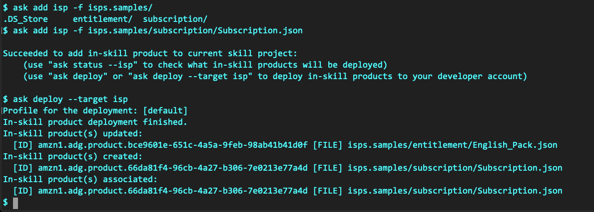

**[Alexaスキル内課金ワークショップ](./Readme.md)**

# 課題４ サブスクリプション商品の追加


課題３までは、**買い切り型**の商品を購入できるようにしました。課題４では、同じサービスを**サブスクリプション型**で提供する商品を追加します。

ユーザーは支払い方法を、買い切り、またはサブスクリプションのどちらかを選択できるようにします。二つの商品は同じサービスを提供するため、ユーザーが両方の商品を重複して購入しないよう制御する必要があります。

課題４をクリアすると、サブスクリプション型の商品をスキル内で販売できるようになります。タイプの異なる複数のスキル内商品を取り扱う方法も習得することができます。

## サブスクリプション商品
サブスクリプション商品には以下のようの特徴があります。

- サブスクリプション商品では、支払いタイプを毎月(MONTHLY)か毎年(YEARLY)のどちらかを設定できる。
- 初回の試用期間を0日から31日まで設定できる。
- ユーザーが自らサブスクリプションの契約を解除(キャンセル)できる。キャンセルしても、次回の更新日まではサービスを利用し続けることができる。

スキルの実装方法は、**サブスクリプション型**でも、**買い切り型**とほぼ同様になります。違いは、購入フローに移ったときのAlexaの自動応答の内容がサブスクリプション向けに変わることだけです。つまり、開発者は**買い切り型**と**サブスクリプション型**の違いをほぼ意識せずに実装することができます。

## 準備
1. サブスクリプション型の商品を追加します。

      **Alexa開発者コンソールで追加する場合**

      1. Alexa開発者コンソールのスキル内商品ページを開きます。

      1. 「スキル内商品を作成」ボタンをクリックします。

      1. 参照名に **Subscription**、スキル内商品の種類は「サブスクリプション型」を選択し、「スキル内商品を作成」ボタンをクリックします。

            
      
      1. サポートされる言語に「日本語(日本)」を追加します。

      1. 以下のように商品情報を入力し「保存」ボタンをクリックします。

            項目|説明|サンプル値
            ---|----|--------
            **表示名**|この商品の表示名。 | サブスクリプション|
            **説明**| 商品の簡単な説明。 ユーザーはこの説明を音声で聞くことになります。| サブスクリプションを購入すると、英語で「こんにちは」と言ってくれます。|
            **詳細な説明**| 商品の機能や使用要件など詳細な説明。画面付きデバイスの購入カードなどに表示されます。| サブスクリプションを購入すると、英語で「こんにちは」と言ってくれます。|
            **小さいアイコン**| スキルストアや Alexa アプリで商品表示に利用する小さいアイコン。| https://skillsassets.s3-ap-northeast-1.amazonaws.com/icons/Subscription_108.png|
            **大きいアイコン**| スキルストアや Alexa アプリで商品表示に利用する大きいアイコン。| https://skillsassets.s3-ap-northeast-1.amazonaws.com/icons/Subscription_512.png|
            **購入プロンプトの説明**| ユーザーが購入を実行したときに聞く商品の説明です。| サブスクリプションを購入すると、英語で「こんにちは」を聞くことができます。|
            **購入確認の説明**| Alexaコンパニオンアプリの購入後確認カードに表示されます。| サブスクリプションを購入しました。日本語の「こんにちは」を英語で言ってくれます。|

      1. **価格設定と購入可能状況**では、Amazon.co.jp にチェックを入れ、価格はひとまず100円と入力します。**税金のカテゴリー**には「ソフトウェア」を選択します。

      1. サブスクリプション型の場合、**請求**のセクションが追加されます。ここでは、請求の頻度を**毎月**、試用期間を**7日**に設定します。

            

      1. **テスト項目**は任意に入力し、最後に「保存」ボタンをクリックし登録が完了します。

      **ASK CLIで追加する場合**

      1. スキル内商品を登録します。すでに作成済みの「サブスクリプション」のJSONコード(Subscription.json)があるので、これをデプロイします。

      1. 商品の定義ファイルを追加します。

            ```bash
            $ ask add isp -f isps.samples/subscription/Subscription.json 
            ```

      1. スキル内商品をデプロイします。

            ```bash
            $ ask deploy --target isp
            ```

            出力結果
            

      1. 以上でサブスクリプション型のスキル内商品**Subsciption**が登録されスキルにリンクされました。

## コーディングのヒント

### インテントを追加する

1. サブスクリプション商品を購入するためのインテント **BuySubscriptionIntent**を追加します。サンプル発話は「サブスクリプションを購入」「サブスクリプションについて教えて」などを追加します。

2. サブスクリプション商品はユーザー自身が音声で解約（キャンセル）できるようにします。そのためのインテント **CancelSubscriptionIntent**を用意します。サンプル発話は「サブスクリプションをキャンセル」「サブスクリプションを解約」などを追加します。

### index.js コードを編集する

1. サブスクリプション商品に関連するインテントを処理する二つのインテントハンドラー **BuySubscriptionIntentHandler** と **CancelSubscriptionIntentHandler** を追加し実装します。

1. スキルにリンクされた商品情報を取得する際には、一回のAPIコールで全ての商品情報を取得できる、`getInSkillProducts()`メソッドを利用するとよいでしょう。

      > `getInSkillProducts()`メソッドの記述方法は、[こちら](https://ask-sdk-for-nodejs.readthedocs.io/ja/latest/Calling-Alexa-Service-APIs.html#getinskillproducts)を参照してください。

1. `getInSkillProducts()`のAPI応答は、以下のように複数の商品情報のレコードが配列で返ってきます。ここからユーザーがどの商品を購入できるか、どちらの商品を購入したかを判断することができます。

      

      > 「英語パック」と「サブスクリプション」は支払い方法が異なるだけで、両者とも同じサービスを提供する性質上、このスキルではユーザーが両方の商品を購入してしまうことを避ける必要があります。

1. **WhatCanIBuyIntentHandler**を修正します。

      `getInSkillProducts()`メソッドを使ってユーザーが購入できる商品を取得し、応答文を組み立てます。ユーザーがスキル内商品をまだ購入していない場合は、「英語パック**または**サブスクリプションのどちらかを購入できます。・・・」という応答を返します。どちらか一方を購入済みの場合は、「すでに{商品名}をお持ちです。続けますか？」と行った返答を返すと良いでしょう。

1. **SayEnglishHelloIntentHandler**を修正します。

      ユーザーが「英語で言って」と要求した場合には、「英語パック」もしくは「サブスクリプション」のどちらかの購入を促す**Upsell**に誘導します。スキル内商品が「英語パック」だけの場合は、直接 Upsell ディレクティブに渡すことができましたが、今回はユーザーにどちらの商品に興味があるかを尋ねる必要があります。Alexaの発話例は以下のようになります。

      ```text:プロンプトの例
      英語で「こんにちは」を聞くには、買い切りの英語パックまたは毎月払いのサブスクリプションのどちらかを購入する必要があります。「英語パックについて教えて」または「サブスクリプションについて教えて」と言ってください。ここまま続けたい場合は「こんにちは」と言ってください。
      ```

1. その他の細かい微調整を行い、買い切り型に加え、サブスクリプション商品も追加したシンプルハローワールドスキルを完成させてください。

以上で課題４は終了です。課題５へ進んでください。

:point_right: [課題５ スキルの認定と公開](5-submit-for-certification.md)

----

## 参考

### GitHub.com その他のスキル内課金サンプルコード
- [プレミアムハローワールド - skill-sample-nodejs-premium-hello-world](https://github.com/alexa/skill-sample-nodejs-premium-hello-world/tree/ja-JP)
      
  複数のスキル内商品をハンドルするサンプルスキルです。課題４の参考になります。

- [プレミアムトリビア - skill-sample-nodejs-fact-in-skill-purchases](https://github.com/alexa/skill-sample-nodejs-fact-in-skill-purchases/tree/ja-JP)

  Fact（トリビア）スキルをスキル内課金に対応させたサンプルスキル。1つのサブスクリプション型商品と3つの買い切り型商品をハンドルしており、より実用に近い実装がなされています。

### オンラインビデオ

- [Alexa道場 Live：スキル内課金を動かしてみよう！](https://youtu.be/wBJcZc33prs)

  サンプルコードを使用して、スキル内課金の機能が動作するまでの一連のステップをご紹介しています。


